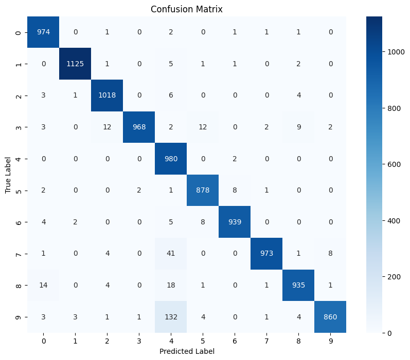
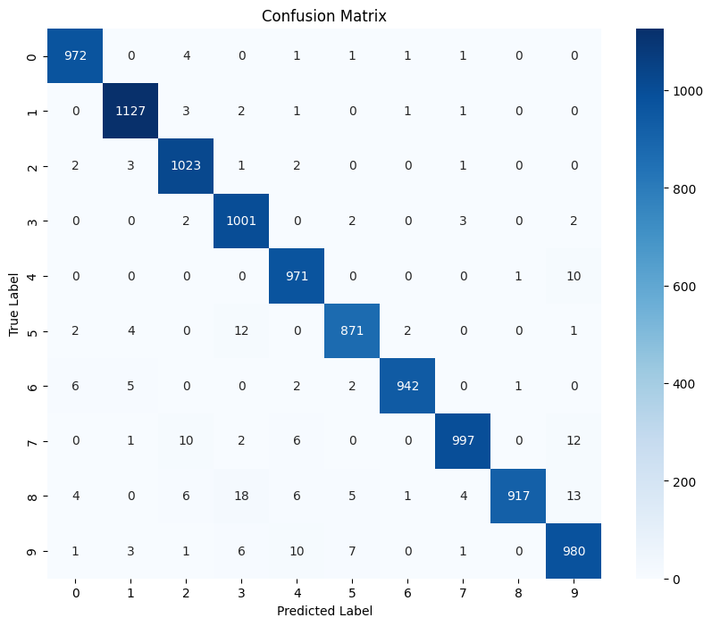

# CNN MNIST Project

This project implements a Convolutional Neural Network (CNN) to classify handwritten digits using the MNIST dataset. 
The project includes various improvements such as dropout and L1 and L2 regularization.

## Project Structure:

```
cnn_mnist/
    asdf.py
    base_model.py
    improvements/
        __init__.py
        model_with_dropout.py
        model_with_l1_regularization.py
        model_with_l2_regularization.py
    main.py
    model/
        fingerprint.pb
        saved_model.pb
        variables/
            variables.data-00000-of-00001
            variables.index
    model_functions.py
    models/
        base_model/
            fingerprint.pb
            ...
        README.md
    README.md
    requirements.txt
    train_dropout.py
    train_l1_regularization.py
    train_l2_regularization.py
    train.py
```

## Installation:

1. Clone the repository:
    ```bash
    git clone <REPOSITORY_URL>
    cd cnn_mnist
    ```

2. Install the dependencies:
    ```bash
    pip install -r requirements.txt
    ```

## Usage:

### Training:

To train the base model:
    ```bash
    python train.py
    ```

To train the model with dropout:
    ```bash
    python train_dropout.py
    ```

To train the model with L1 regularization:
    ```bash
    python train_l1_regularization.py
    ```

To train the model with L2 regularization:
    ```bash
    python train_l2_regularization.py
    ```

### Evaluation:

The trained models are saved in the `models/` directory. You can load and evaluate the models using the appropriate scripts.

### Prediction:

To make predictions using the FastAPI API, run the server:
    ```bash
    python main.py
    ```

Access [http://localhost:8000](http://localhost:8000) to use the API.

## Improvements:

- `model_with_dropout.py`: Model with dropout.
- `model_with_l1_regularization.py`: Model with L1 regularization.
- `model_with_l2_regularization.py`: Model with L2 regularization.

## Results:

The results of the trained models are saved in the `models/` directory.


### Base model 

#### Metrics

```
Accuracy: 0.965
Precision: 0.9685941533933192
Recall: 0.965
F1 Score: 0.9653356784311873
```

#### Confusion Matrix



## Improvements

We propose three improvements to the model:
    - Dropout regularization
    - L1 regularization
    - L2 regularization

The results are below:

### L1 regularization 

```
Accuracy: 0.9737
Precision: 0.9743373214022366
Recall: 0.9737
F1 Score: 0.9735207524792991
```

#### Confusion Matrix


### L1 regularization 
```
Accuracy: 0.9803
Precision: 0.9804292632640894
Recall: 0.9803
F1 Score: 0.9802803264700615
```

#### Confusion Matrix


### Dropout


```
Accuracy: 0.9801
Precision: 0.9803238665051038
Recall: 0.9801
F1 Score: 0.9800765254359105
```

#### Confusion Matrix



## Conclusion

All improvements slightly increased the model's performance. The best model was the one with L2 regularization, which achieved an accuracy of 98.03%.
